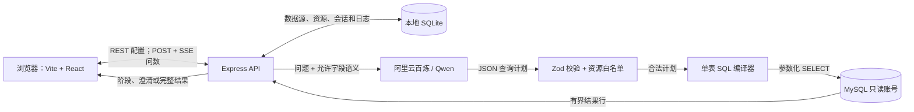

# 技术实现设计：learning-mvp

## 文档状态与读者

**状态：首轮技术设计已评审通过并进入实现。** 产品行为以 `docs/PRD.md` 和本变更下的规格为准；本文件说明这些行为如何映射到页面、接口、状态和持久化结构。若实现时需要改变可观察行为，先更新规格再改代码。

面向三类接手者：

- 前端开发：根据页面清单、接口契约和状态机实现界面。
- 后端开发：根据路由、应用服务、查询计划和 SQL 安全边界实现 API。
- 数据层开发：根据 SQLite 数据表、MySQL 演示结构、迁移和种子数据实现本地持久化。

## 1. 目标、范围与术语

### 1.1 本次交付目标

在一台开发机上完成以下完整链路：

```text
管理员连接 MySQL
  → 浏览表和样例行
  → 发布一张表并配置字段含义
  → 配置并测试百炼/Qwen
  → 问数用户选择资源并提问
  → 系统返回结构化查询计划，必要时先澄清
  → 服务端校验计划并编译单表只读 SQL
  → MySQL 执行查询
  → 页面展示理解结果、SQL、表格和图表
  → 在同一资源会话内继续追问
```

### 1.2 不在本方案范围内

真实登录、服务端角色授权、多租户、跨表查询、上传文件、自由 SQL、模型直接执行 SQL、自动选资源、实时输出模型 token、模型路由、自动密钥轮换、远程部署和生产级运维。本地角色切换只用于演示两个视图，不承担安全控制。

### 1.3 核心术语

| 术语     | 含义                                                                                            |
| -------- | ----------------------------------------------------------------------------------------------- |
| 数据源   | 一组 MySQL 连接参数。本期界面允许保存一个数据源。                                               |
| 问数资源 | 从数据源中选择的一张表，加上字段语义、业务术语和推荐问题。                                      |
| 字段     | MySQL 表中的实际列。前端展示语义字段 ID、业务名称和角色；SQL 编译器再将字段 ID 映射为实际列名。 |
| 查询计划 | 模型输出的 JSON 意图，只包含允许字段、聚合、筛选、排序和图表提示，不含 SQL。                    |
| 问数轮次 | 用户在一个会话中提交的一次问题，或对某个澄清问题的一次回答。                                    |

### 1.4 已确认技术选型

| 层次            | 选型与固定边界                                                                |
| --------------- | ----------------------------------------------------------------------------- |
| 运行形态        | 本地浏览器；Node 服务默认绑定 `127.0.0.1`                                     |
| 前端            | Vite + React + TypeScript、Ant Design、Ant Design Charts、React hooks/reducer |
| 后端            | Node.js 24 LTS + TypeScript + Express 5                                       |
| 工作区          | pnpm 10.34.2 workspace：`apps/web`、`apps/api`、`packages/contracts`          |
| 演示业务库      | Docker Compose 启动 MySQL 8.4 LTS，只映射到本机 3306                          |
| SmartQ 自身数据 | Node `better-sqlite3`，SQL 文件迁移                                           |
| 模型            | 阿里云百炼/通义千问 OpenAI 兼容 Chat Completions；API 地址和模型 ID 可配置    |
| 问数传输        | JSON REST；问数轮次使用 POST + SSE，由前端 `fetch` 读取                       |
| 模型输出        | JSON 查询计划；Zod 运行时校验；后端只生成单表参数化 `SELECT`                  |
| 演示身份        | 页面内管理员/问数用户切换，无登录、无 API 角色授权                            |

## 2. 系统结构与运行方式

### 2.1 结构图



浏览器不持有数据库或模型密钥，也不连接 MySQL。SQLite 保存 SmartQ 配置和对话元数据；MySQL 保存演示订单。Express 是所有数据访问和模型调用的唯一入口。

### 2.2 本地服务、端口与启动顺序

| 服务            | 地址/端口            | 说明                                              |
| --------------- | -------------------- | ------------------------------------------------- |
| Vite 开发服务器 | `127.0.0.1:5173`     | 开发期间提供 React 页面，将 `/api/*` 代理至 API   |
| Express API     | `127.0.0.1:3000`     | 配置接口、问数流程、SSE、开发构建后的静态页面托管 |
| Docker MySQL    | `127.0.0.1:3306`     | 容器仅对本机开放；MySQL 健康后再运行 Node 服务    |
| SmartQ SQLite   | `data/smartq.sqlite` | 仓库忽略；首次启动时运行迁移                      |

第一次启动顺序：复制 `.env.example` 为 `.env.local` 并填本地演示变量 → `pnpm install` → `pnpm db:up` → 等待 MySQL 健康检查成功 → `pnpm db:seed` → `pnpm dev`。`db:up/db:down` 脚本以仓库根目录为工作目录，执行 `docker compose --env-file .env.local -f demo/mysql/compose.yaml ...`，确保 Compose 能读取 `.env.local`。README 需记录停止、查看日志和清空本地演示卷的命令。

MySQL Compose 服务使用 `mysql:8.4`，挂载命名卷和 `demo/mysql/init/`。初始化 SQL 创建 `smartq_demo.orders`，再单独创建 `smartq_reader` 并只授予 `SELECT`。不可使用 Docker 官方镜像 `MYSQL_USER` 变量创建此只读用户，因为该方式会给 `MYSQL_DATABASE` 授予 `GRANT ALL`。根账号只供初始化和种子脚本使用，SmartQ 数据源配置必须填 `smartq_reader`。

### 2.3 工作区目录

```text
apps/
  web/
    src/app/                 页面路由、应用入口、演示角色切换
    src/features/data-source/ 数据源配置、表浏览和预览
    src/features/resources/ 资源、字段语义、业务术语、推荐问题和样例调试
    src/features/models/    模型配置
    src/features/chat/      会话、消息、澄清、结果表格和图表
    src/shared/api/          REST 客户端
    src/shared/sse/          POST SSE 解析器
  api/
    src/http/                Express 启动、路由、HTTP/SSE 转换
    src/application/          用例编排
    src/domain/               查询计划、校验规则、SQL 编译规则
    src/infrastructure/       SQLite、MySQL、百炼和加密适配器
packages/
  contracts/src/              前后端共享的 Zod schema 和类型
demo/mysql/
  compose.yaml
  init/                       建库、建表、创建只读用户
  seed/                       可重复生成合成订单
data/                         本地 SQLite；不提交到版本库
```

目录可以随实现微调，但 React 页面不能直接依赖 `mysql2`、SQLite 驱动或百炼适配器。前后端共享的字段和事件结构必须放在 `packages/contracts`。

### 2.4 根目录命令约定

| 命令              | 行为                                                                              |
| ----------------- | --------------------------------------------------------------------------------- |
| `pnpm dev`        | 并行启动 API 和 Vite                                                              |
| `pnpm build`      | 构建前端和 API                                                                    |
| `pnpm db:up`      | 启动 Compose 中的 MySQL                                                           |
| `pnpm db:down`    | 停止 MySQL 容器，不删除数据卷                                                     |
| `pnpm db:seed`    | 使用演示管理员凭据重灌 304 条合成订单；日期以 `SMARTQ_DEMO_DATE` 或执行当日为基准 |
| `pnpm db:reset`   | 删除本地演示卷并重新初始化；命令执行前需明确提示会清空演示数据                    |
| `pnpm db:migrate` | 对 `data/smartq.sqlite` 执行未运行的 SQLite 迁移                                  |

`.nvmrc` 固定为 Node `24`；根 `package.json` 的 `packageManager` 固定为 `pnpm@10.34.2`。真实密钥放 `.env.local`，该文件及 `data/` 必须在 `.gitignore` 中；`.env.example` 只含字段名和假值。

## 3. 页面功能、路由与前端责任

### 3.1 页面路由

| 页面路由               | 主要用户 | 页面目标                                                                                       |
| ---------------------- | -------- | ---------------------------------------------------------------------------------------------- |
| `/ask`                 | 问数用户 | 选择资源、创建会话、查看推荐问题和开始提问                                                     |
| `/ask/:conversationId` | 问数用户 | 查看历史消息、继续当前资源会话、回答澄清                                                       |
| `/admin/data-source`   | 管理员   | 新建/测试 MySQL 连接、查看表结构和有界样例                                                     |
| `/admin/resources`     | 管理员   | 按表格浏览问数资源；从操作列打开配置抽屉，配置字段语义、业务术语、推荐问题，调试样例问题并发布 |
| `/admin/model`         | 管理员   | 配置模型服务、测试连接、保存默认模型                                                           |

全局顶部提供“管理员 / 问数用户”切换器。切换只改变路由和页面入口，不隐藏后端接口、不作为授权检查。初次打开进入 `/ask`；没有已发布资源时显示空状态及管理员入口。

### 3.2 管理员：数据源页面

页面区域及交互：

1. 连接表单：主机、端口、数据库名、用户名、密码。密码输入使用密码框；已保存连接只返回 `passwordConfigured` 和掩码，不返回明文。
2. “测试连接”：发送当前未保存表单。测试成功显示 MySQL 版本和可浏览状态；失败保留输入并显示安全错误文案。
3. “保存连接”：管理员先测试表单，后端保存时还会用同一组参数再次连接验证，避免表单测试成功后连接信息已变化；验证成功后才保存为 `ready`。当前产品只支持一个有效连接；保存另一个配置时更新当前数据源，而不是展示多连接管理器。
4. 表清单：显示表名、备注、字段数量。点选表后展示字段名、MySQL 类型、是否可空和最多 20 行样例预览；点击“查看完整数据”打开表格抽屉，支持查看总记录数并按页浏览整张表，每页最多向页面返回 20 行。
5. “创建问数资源”：输入资源显示名后创建草稿并跳转至资源配置页。

页面状态至少有 `未配置`、`测试中`、`测试成功`、`测试失败`、`保存中`、`读取表清单中`、`完整数据读取中`、`完整数据读取失败`、`无可用表`。退出页面或切换角色不把表单中的密码写入浏览器持久化存储。

### 3.3 管理员：问数资源配置页面

页面主体为问数资源表格，每个资源占一行，展示资源名称、来源表、数据源、字段数、状态和创建时间；表格行操作提供“配置”入口。点击后在右侧配置抽屉中加载该资源，不离开资源列表页面。数据源页面创建资源并导航到本页时，自动打开新资源的配置抽屉。不建设多层级资源目录。

配置抽屉由“资源信息、字段配置、业务术语、推荐问题、样例调试、结构检查”几个面板组成，继续复用本节下述配置能力。抽屉宽度应容纳现有双列字段编辑；内容超过抽屉可视区域时仅抽屉正文滚动。资源列表页固定在应用视口内，表格数据区自行滚动，不产生页面级滚动条。

- 资源信息：显示资源名、MySQL 数据库/表名、资源状态 `draft/active/needs_review` 和结构刷新时间。
- 字段配置表：每行一个字段；列包括原始列名、MySQL 类型、展示名、业务说明、语义角色、是否可问、单位、默认聚合、同义词。
- 语义角色：`dimension`（维度）、`metric`（指标）或 `hidden`（不可问）。`hidden` 强制 `enabled=false`；不可问字段不能出现在 prompt、查询计划或 SQL。
- 默认聚合：仅指标字段可选 `sum/avg/count/min/max`；字段类型不兼容时后端也必须拒绝该设置。
- 可用聚合由后端根据 MySQL 类型和语义角色生成，并通过字段详情的 `allowedAggregations` 返回；数值指标允许 `sum/avg/min/max/count`，非数值指标只允许 `count`。管理员只能选择其中一个作为默认聚合，不能自行扩大允许范围。
- 业务术语：术语、定义、同义词、可选目标字段。术语必须关联到当前资源字段或当前资源，不支持全企业术语库。
- 推荐问题：每个资源最多 4 条；列表顺序即问数页面展示顺序。
- 样例调试：管理员在本页输入自然语言问题，调用 `POST /api/resources/:resourceId/plan-preview`，查看模型计划、字段映射和校验错误；调试不执行 SQL，也不产生正式会话。
- 发布：资源名有效且至少一个指标或维度字段允许问数即可；命名指标和推荐问题可选，已填写的命名指标仍须全部通过字段、聚合及固定过滤校验。新资源按类型和字段名称规则初始化可问范围；保存成功后 `status=active`。
- 结构变更：显示新增/变更/删除字段的差异。新增字段默认不可问；发生变更时资源转为 `needs_review`。管理员保存复核后的字段配置并确认当前 `schemaHash` 后才能重新发布。

### 3.4 管理员：模型配置页面

模型表单包含百炼 API Base URL、模型 ID、API Key 和默认启用状态。API Key 新输入时以密文保存；重新打开页面仅见掩码和“已设置”标记。保存时不输入新 Key 表示沿用旧 Key；清除密钥必须由独立的“清除已保存密钥”操作触发。

“测试连接”调用模型完成一条短文本请求，只验证网络、鉴权和模型 ID；测试内容和返回文本不得写入问数会话。只有测试成功才允许启用为默认模型。

### 3.5 问数用户：问数工作台

工作台由会话列表、资源选择器、推荐问题区、对话时间线和输入栏组成。

- 创建会话前选择一个 `active` 资源；会话创建后绑定该资源，不允许在会话中切换底层资源。
- 用户要换资源时，前端提示并新建一个绑定新资源的会话；旧会话和上下文保持不变。
- 推荐问题点击后直接填入并提交输入框。
- 每条助手回答按结构化内容块呈现：问题理解、查询条件、SQL 折叠区、结果表格、图表和失败/澄清信息。
- 澄清选项以按钮显示；可自由回答时提供文本输入。确认前不得执行 SQL；待澄清轮次提供“取消本轮”入口，回答或取消前不能在同一会话提交新问题。
- 结果最多 200 行。超过上限时显示截断提示；前端不自动发起翻页或补查。
- 图表只在已返回数据上切换，不重复调用模型或数据库。柱状图要求一个分类维度和一个指标；折线图要求时间维度和一个指标；不满足条件时只显示表格。

## 4. 前端实现契约

### 4.1 API 客户端

`shared/api` 统一设置 `/api` 前缀、JSON 编解码、响应 Zod 校验和错误映射。页面和组件不直接调用 `fetch`（SSE 客户端除外），避免各页面自行处理错误格式。

REST 请求错误统一读取 `{ "error": { "code", "message", "stage?", "fieldErrors?" } }`。页面面向用户显示 `message` 和字段错误；调试信息只可显示不含密钥、不含 provider 原文的 `code/stage`。

### 4.2 问数状态机

会话状态由 `useReducer` 管理，单轮状态如下：

```text
idle
  → submitting
  → understanding
  → clarification_required → submitting（提交澄清回答）
  → executing
  → succeeded | empty | failed | cancelled | interrupted
```

`cancelled/interrupted` 后可以重新提问；`clarification_required` 时仅允许回答或取消当前轮次，不允许另开问题。

每个事件携带 `conversationId`、`turnId` 和本次 HTTP 提交的 `requestId`。reducer 只接受当前路由会话、当前逻辑轮次和当前流请求的事件；迟到的旧事件直接丢弃，避免快速切换会话或澄清请求后覆盖新状态。一个会话同时只允许一个活动轮次；提交期间禁用重复发送，提供取消按钮。

用户主动点“取消”时，前端先调用 `DELETE /api/conversations/:conversationId/turns/:turnId`，收到响应后关闭 SSE reader；切换会话、切换角色或组件卸载时只中止本地 reader。如果浏览器流意外断开，轮次标记为 `interrupted`，显示“本轮中断”和重新提问入口。本期不实现 SSE 断点续传。

### 4.3 SSE 解析

问数请求为带 JSON body 的 `POST`，不能使用只能发起 GET 的原生 `EventSource`。前端使用 `fetch` 取得 `ReadableStream<Uint8Array>`，增量使用 `TextDecoder` 解码，按空行拆分 SSE frame，再根据 `event` 与 `data` 解析事件。解析器必须处理：多字节中文被拆到不同 chunk、一个 chunk 含多个 frame、注释心跳行、末尾不完整 frame、AbortError 和非 200 的 JSON 错误响应。

### 4.4 表格与图表适配

共享结果结构为 `columns + rows`。Ant Design Table 的 `dataIndex` 使用稳定字段 key，不能用展示中文名作为对象 key。大整数和 `DECIMAL` 结果以字符串保留精度；图表适配器只在绘图时将可解析数值转为 number，并保留原始字符串供表格显示。

图表选择是本地表现层状态：`table/bar/line/metric`。图表不适用或数据为空时降级为表格/空状态；不得为了生成图表再次执行 SQL。

## 5. 后端模块职责

Express 按四层组织。路由只处理 HTTP、SSE 和共享 schema 校验，不编写 SQL 业务逻辑。

| 层          | 负责内容                                                       | 典型模块                                                                  |
| ----------- | -------------------------------------------------------------- | ------------------------------------------------------------------------- |
| HTTP 路由层 | JSON 解析、状态码、SSE headers/frame、AbortSignal、错误转 HTTP | `dataSourceRoutes`、`resourceRoutes`、`modelRoutes`、`conversationRoutes` |
| 应用用例层  | 协调一个完整用户动作、事务边界和记录状态                       | `testDataSource`、`saveResource`、`previewPlan`、`runQuestionTurn`        |
| 领域层      | 计划类型、计划合法性、字段类型规则、SQL 编译、结果解释         | `queryPlanSchema`、`planValidator`、`sqlCompiler`、`resultPresenter`      |
| 基础设施层  | 外部系统适配和持久化                                           | `SqliteRepository`、`MysqlAdapter`、`QwenAdapter`、`SecretCipher`         |

关键职责分工：

- `MysqlAdapter` 负责打开短期测试连接、列举表/字段、有限预览、分页只读浏览、只读问数查询和资源结构刷新；接收业务层生成的已校验查询，不接收任意 SQL 字符串。
- `QwenAdapter` 负责向配置的百炼 OpenAI 兼容地址发送 Chat Completions 请求、超时/取消和 provider 错误归一化；不决定资源权限，也不执行 SQL。
- `PlanValidator` 根据资源状态、字段 `enabled`、角色、类型、聚合和过滤操作符校验模型输出；不信任模型自称“已校验”。
- `SqlCompiler` 只接受通过 validator 的内部查询计划，将字段 ID 映射为 introspection 存储的实际列名；所有值生成独立参数数组。
- `QueryExecutor` 只允许调用 compiler 产生的语句，附带行数/时间上限，通过专用只读账号执行。
- `ResultPresenter` 根据已执行计划和真实结果生成确定性说明及图表建议；本期不调用第二次模型来写分析结论。

## 6. 功能模块与接口总览

| 功能模块 | 前端页面/功能                                | 后端接口                                                                           | 主要持久化                                                                | 对应规格              |
| -------- | -------------------------------------------- | ---------------------------------------------------------------------------------- | ------------------------------------------------------------------------- | --------------------- |
| 服务状态 | 首屏可用性/错误提示                          | `GET /api/health`                                                                  | 无                                                                        | 全局                  |
| 数据源   | 连接表单、测试、保存、表浏览、样例预览       | `/api/data-sources/*`                                                              | `data_sources`                                                            | `data-onboarding`     |
| 问数资源 | 资源清单、单表草稿、字段语义、发布、结构复核 | `/api/resources/*`                                                                 | `resources`、`resource_fields`、`business_terms`、`recommended_questions` | `data-onboarding`     |
| 模型配置 | 百炼参数、密钥遮蔽、连通性测试               | `/api/models/*`                                                                    | `model_configs`                                                           | `admin-configuration` |
| 计划调试 | 样例问题、结构化计划、字段映射、校验结果     | `POST /api/resources/:id/plan-preview`                                             | 不持久化正式会话或查询结果                                                | `admin-configuration` |
| 会话     | 新建、列表、历史消息、资源固定               | `/api/conversations*`                                                              | `conversations`、`messages`                                               | `questioning`         |
| 问数轮次 | 提问、澄清、执行、结果/错误 SSE、取消        | `POST /api/conversations/:id/turns`、`DELETE /api/conversations/:id/turns/:turnId` | `messages`、`query_runs`                                                  | `questioning`         |
| 演示角色 | 页面入口切换                                 | 无 API                                                                             | 不持久化或仅存 `sessionStorage`                                           | `admin-configuration` |

### 6.1 端到端接口调用顺序

**管理员接入并发布资源：**

1. 页面启动调用 `GET /api/health`、`GET /api/data-sources` 和 `GET /api/models/config`，据响应决定显示首次配置表单还是已有配置。
2. 管理员填写数据库连接后先调用 `POST /api/data-sources/test`；测试成功才调用 `POST /api/data-sources` 保存。后续改连接使用 `PUT /api/data-sources/:id`，然后必须重新测试。
3. 保存的数据源就绪后调用 `GET /api/data-sources/:id/schema` 展示表清单；选表时可调用 `GET /api/data-sources/:id/tables/:tableName/preview?limit=20`。
4. 管理员创建资源调用 `POST /api/resources`，再根据返回的资源 ID 读取 `GET /api/resources/:id`。配置字段后用 `PUT /api/resources/:id` 保存；术语通过 `PUT /api/resources/:id/business-terms` 保存；结构检查使用 `POST /api/resources/:id/schema/refresh`。
5. 管理员调试样例问题调用 `POST /api/resources/:id/plan-preview`。模型设置页面使用 `GET /api/models/config`、`POST /api/models/test`、`PUT /api/models/config`。计划预览只显示计划和校验结果，不执行数据库查询。

**问数用户完成一轮提问：**

1. 工作台调用 `GET /api/resources?status=active` 展示资源；创建会话时调用 `POST /api/conversations`，打开已有会话时调用 `GET /api/conversations/:id`。
2. 每次提交问题或澄清回答都生成新的 `requestId`，调用 `POST /api/conversations/:id/turns`。接口先校验并建立 SSE 响应，发送 `turn.started` 和当前粗粒度 `stage`；实际处理过程中按阶段发送 `progress(started/completed)`，结束时发送 `clarification.required`、`result` 或 `error`，最后发送 `turn.completed` 并关闭流。
3. 初次提问遇到澄清时，服务端保存原问题、澄清问题与选项，以 `awaiting_clarification` 结束该次流。用户选择选项或填写自由文本后，用同一 `turnId`、新的 `requestId` 和原 `clarificationId` 再次 POST；服务端把原问题、澄清问题和已确认答案重新交给模型规划，取得最终计划并校验，之后才可执行。
4. 用户主动取消调用 `DELETE /api/conversations/:id/turns/:turnId`；导航离开造成的 reader 中止不会调用取消接口，服务端将未完成轮次记为 `interrupted`。

单轮正常查询的事件顺序包含 `turn.started → stage(understanding) → progress(resource_context) → progress(planning) → progress(validation) → progress(compilation) → stage(executing) → progress(query) → progress(presentation) → result → turn.completed(succeeded|empty)`；需要澄清时在计划校验后发送 `clarification.required → turn.completed(awaiting_clarification)`，不执行 SQL。错误在流建立后用 `error → turn.completed(failed)` 返回；输入/会话校验失败则在流建立前用普通 HTTP 错误返回。每个 progress 阶段各有 started/completed 两个事件，步骤编号在当前请求内递增；若阶段失败，只保存此前已完成阶段以及该阶段未完成的说明。

## 7. REST API 契约

### 7.1 通用约定

- API 前缀：`/api`；开发环境由 Vite 代理；演示构建由 Express 同源托管。
- 请求与普通响应均为 UTF-8 JSON；时间戳使用 ISO 8601 UTC 字符串。
- ID 使用 UUID；MySQL 金额 `DECIMAL` 在 JSON 中用字符串，避免精度损失。
- 所有写请求先由 `packages/contracts` 中的 Zod schema 校验。未知字段默认拒绝，不静默丢弃安全相关字段。
- 用户问题最多 1,000 字；澄清自由文本最多 300 字；空白问题拒绝。分页和行数参数由服务端设上限，不接受负数或超大值。
- 成功响应直接返回资源对象；错误响应格式见“错误契约”。不得返回密文、主密钥、MySQL root 密码、模型原始密钥、完整 provider 原始错误。
- 本地无登录；所有 API 都可由本机访问。不得把角色切换器当作服务端授权。

### 7.2 服务状态

#### `GET /api/health`

页面启动后检查 API 和 SQLite 迁移状态；不检查模型调用，也不为了健康检查主动读取业务行。

成功响应：

```json
{
  "status": "ok",
  "appVersion": "0.1.0",
  "sqlite": "ready",
  "nodeMajor": 24
}
```

仅当 API 启动完成且 SQLite 迁移可用时返回 `200`；SQLite 未就绪返回 `503` 统一错误，页面显示“本地服务未就绪”及重试入口。

### 7.3 数据源接口

#### `POST /api/data-sources/test`

测试尚未保存的连接表单。仅建立短期连接并查询服务版本，不保存任何字段。

请求：

```json
{
  "host": "127.0.0.1",
  "port": 3306,
  "database": "smartq_demo",
  "username": "smartq_reader",
  "password": "demo-password"
}
```

成功响应：`{ "ok": true, "serverVersion": "8.4.x", "database": "smartq_demo" }`。失败使用统一错误响应；对前端隐藏堆栈和完整驱动错误。

#### `POST /api/data-sources`

保存首个数据源；已有数据源时返回 `409 DATA_SOURCE_EXISTS`，前端改用更新接口，避免静默覆盖。服务端保存前会重新建立连接并验证数据库名，不能只信任前端之前的测试结果；验证成功后才落库并设置 `status=ready`。

请求与测试接口相同，可附加 `name`。成功返回：

```json
{
  "id": "uuid",
  "name": "本地演示 MySQL",
  "host": "127.0.0.1",
  "port": 3306,
  "database": "smartq_demo",
  "username": "smartq_reader",
  "passwordConfigured": true,
  "passwordMasked": "••••••••",
  "status": "ready",
  "lastTestedAt": "2026-09-24T08:00:00.000Z"
}
```

#### `PUT /api/data-sources/:dataSourceId`

更新现有连接。字段规则与创建一致；`password` 缺省表示保留原密钥，`clearPassword: true` 表示清除（不可与 `password` 同时传）。服务端保存前使用新旧合成后的完整配置重新连接验证；验证失败不覆盖原配置，返回 `503 DATA_SOURCE_UNAVAILABLE`；成功才原子替换配置并返回 `status=ready`。

#### `POST /api/data-sources/:dataSourceId/test`

测试已保存数据源的修改表单，不保存配置。请求中的 `password` 可省略；省略时服务端解密并复用当前已保存密码。首次连接仍使用 `POST /api/data-sources/test`。

#### `GET /api/data-sources`

返回零个或一个数据源，格式与保存响应一致，不返回密码或密文。

#### `GET /api/data-sources/:dataSourceId/schema`

连接数据源并读取当前 database 的表和列元数据。响应：

```json
{
  "database": "smartq_demo",
  "fetchedAt": "2026-09-24T08:00:00.000Z",
  "tables": [{ "name": "orders", "comment": "合成订单", "columnCount": 10 }]
}
```

此接口不取业务行。数据库连接失败返回 `503 DATA_SOURCE_UNAVAILABLE`。

#### `GET /api/data-sources/:dataSourceId/tables/:tableName/preview?limit=20`

只允许预览从该数据源元数据中查到的表；服务端将 `limit` 限制在 `1..20`，列标识符来自 schema introspection 并经过引用。响应：

```json
{
  "tableName": "orders",
  "columns": [{ "name": "order_date", "mysqlType": "datetime", "nullable": false }],
  "rows": [{ "order_date": "2026-01-02 12:30:00" }],
  "limit": 20
}
```

#### `GET /api/data-sources/:dataSourceId/tables/:tableName/rows?page=1&pageSize=20`

用于完整浏览已选数据表。仅允许从当前数据源 schema 中查到的基础表；服务端将 `page` 校验为正整数，并将 `pageSize` 限制在 `1..20`。每次请求只返回当前页的数据，并附带总记录数和总页数。列标识符来自服务端 schema introspection 并经过引用；页码和页大小使用参数绑定计算偏移量。表有主键时按主键排序，便于连续翻页。响应：

```json
{
  "tableName": "orders",
  "columns": [{ "name": "order_date", "mysqlType": "datetime", "nullable": false }],
  "rows": [{ "order_date": "2026-01-02 12:30:00" }],
  "page": 1,
  "pageSize": 20,
  "totalRows": 125,
  "totalPages": 7
}
```

页面使用表格内分页控件浏览，不增加页面级滚动条。查询只使用数据源配置中的只读账号，不提供任何写入接口。

### 7.4 问数资源接口

#### `GET /api/resources?status=active`

返回资源清单，支持 `status=active|draft|needs_review|all`；省略时默认为 `active`。问数用户使用默认筛选，管理员配置页显式请求 `status=all`。

```json
{
  "items": [
    {
      "id": "uuid",
      "displayName": "订单数据",
      "tableName": "orders",
      "status": "active",
      "fieldCount": 8,
      "recommendedQuestions": ["按城市统计销售额"]
    }
  ]
}
```

#### `POST /api/resources`

基于已保存且可用的数据源和一张实际存在的表创建草稿。重复发布相同数据源/表时固定返回 `409 RESOURCE_EXISTS`，不得生成重复资源；前端刷新资源列表并提示管理员打开已有资源。

请求：`{ "dataSourceId": "uuid", "tableName": "orders", "displayName": "订单数据" }`。

成功响应包含资源 ID、`status: "draft"`、`schemaHash` 及按当前 MySQL schema 生成的字段列表。新字段初始 `enabled: false`；可根据类型预填“维度/指标建议”，但未经管理员保存确认不得进入模型上下文。

#### `GET /api/resources/:resourceId`

返回完整配置：资源状态、来源表、schemaHash、全部字段、业务术语和推荐问题。字段信息至少包含：

```json
{
  "id": "field-uuid",
  "columnName": "amount",
  "displayName": "销售金额",
  "description": "订单实际成交金额",
  "mysqlType": "decimal(10,2)",
  "semanticRole": "metric",
  "enabled": true,
  "unit": "元",
  "defaultAggregation": "sum",
  "allowedAggregations": ["sum", "avg", "min", "max", "count"],
  "synonyms": ["销售额"]
}
```

#### `PUT /api/resources/:resourceId`

保存资源信息、字段配置和推荐问题；这是资源配置页的主保存接口。字段必须属于该资源当前 schema；角色/聚合组合必须合法；推荐问题最多 4 条。

请求示例：

```json
{
  "displayName": "订单数据",
  "description": "演示订单及销售情况",
  "status": "active",
  "reviewedSchemaHash": "sha256:...",
  "fields": [
    {
      "id": "field-amount-uuid",
      "displayName": "销售金额",
      "description": "订单成交金额",
      "semanticRole": "metric",
      "enabled": true,
      "unit": "元",
      "defaultAggregation": "sum",
      "synonyms": ["销售额"]
    }
  ],
  "recommendedQuestions": ["按城市统计销售额"]
}
```

若 `status=active`，必须包含最新 `reviewedSchemaHash`，且至少一个指标或维度字段允许问数；命名指标可以为空。如果资源 `needs_review`，该 hash 是解除复核状态的必要条件。`allowedAggregations` 由后端按类型生成，不接受客户端写入；`defaultAggregation` 必须是生成列表中的值。成功响应为更新后的资源详情。

#### `POST /api/resources/:resourceId/schema/refresh`

重新读取源表结构并与资源保存的 snapshot 比较。响应包含 `oldSchemaHash`、`newSchemaHash`、`added[]`、`changed[]`、`removed[]`。hash 对按列顺序规范化后的列名、MySQL 类型、可空性和顺序号计算；列名变更视为删除旧列并新增新列。无变化时保留资源原状态；发现变化时原子地保存新 snapshot，将资源置为 `needs_review`，新增字段设为不可问，删除字段设 `removed_at`，受影响字段在复核前不能用于规划。

#### `PUT /api/resources/:resourceId/business-terms`

整体替换该资源的业务术语。请求 `{ "terms": [{ "term": "净销售额", "definition": "订单实付金额合计", "synonyms": ["净销额"], "targetFieldId": "field-uuid" }] }`。定义和同义词只进入当前资源的模型上下文；目标字段必须属于当前资源。

#### `POST /api/resources/:resourceId/plan-preview`

用真实模型和资源配置页当前表单中的配置解析管理员输入的样例问题，但不保存配置、不执行 SQL、不创建正式会话、不保存查询结果。允许 `draft` 和 `active` 资源，但资源结构必须是最新状态；服务端先刷新 MySQL 表结构摘要，发现变化或资源待复核时暂停预览。字段配置先按当前数据库字段 ID 和现有配置规则校验，再使用与正式查询相同的计划校验；不执行“资源必须 active”这一执行门禁。请求 `{ "question": "今年各城市销售额怎么样", "configuration": { ... } }`，其中 `configuration` 使用 `ResourceConfigurationInput`，让调试结果对应页面上尚未保存的修改。响应 `{ "kind": "query|clarify|reject|invalid", "plan": {}, "validation": { "valid": true, "errors": [] } }`，`plan` 是第 8.2 节定义的联合类型；错误元素为 `{ "code", "path", "message" }`。澄清计划和拒绝计划的结构合法时 `valid=true`；计划语义违规时保留计划并返回 `valid=false`；模型输出无法解析或不符合结构时返回 `kind=invalid`、`plan=null` 和可读校验错误。模型配置缺失、密钥无法解密、模型超时或服务不可用返回 API error，错误正文不得包含密钥或 provider 原文。

### 7.5 模型接口

#### `GET /api/models/config`

返回单个默认模型配置。不存在配置时返回 `{ "configured": false, "enabled": false, "apiKeyConfigured": false }`；存在时返回 `{ "configured": true, "provider": "bailian-openai-compatible", "baseUrl": "...", "modelId": "...", "enabled": true, "apiKeyConfigured": true, "apiKeyMasked": "••••••••", "lastTestAt": "..." }`。不返回密钥或密文。首次配置表单默认值为百炼共享地址 `https://dashscope.aliyuncs.com/compatible-mode/v1` 和模型 `qwen-plus`；两者均可编辑。Base URL 按 `{BaseURL}/chat/completions` 发送 OpenAI 兼容请求。

#### `PUT /api/models/config`

请求 `{ "baseUrl": "https://.../compatible-mode/v1", "modelId": "qwen-plus", "apiKey": "可选的新密钥" }`。`apiKey` 缺省表示沿用已保存密钥；首次配置必须提供密钥。本期不提供清除密钥或停用默认模型的操作。服务端使用待保存的完整配置重新调用模型；调用成功后才原子保存并启用，失败不覆盖现有默认配置。成功响应与 `GET /api/models/config` 一致。密钥使用现有 `SMARTQ_ENCRYPTION_KEY` 通过 AES-256-GCM 加密；持久化只保存密文、随机 IV 和认证标签。

#### `POST /api/models/test`

对表单值做一次短文本 Chat Completions 调用，不持久化配置或测试文本。请求为 `{ "baseUrl": "https://...", "modelId": "qwen-plus", "apiKey": "..." }`；若未提交 `apiKey`，必须显式传 `useSavedKey=true` 使用已保存密钥，二者不可同时出现。只允许 `https`；本地兼容测试服务可用 `http`，且 host 必须是 loopback。成功响应 `{ "success": true, "modelId": "qwen-plus", "responseTimeMs": 650 }`。任何错误都不得返回请求中的 Key 或完整 provider body。提供商调用设置 15 秒超时；401/403、404、429 和连接失败转换为不包含响应正文的中文提示。测试通过是给管理员即时反馈；`PUT` 仍会在服务端重新验证。

### 7.6 会话接口

#### `GET /api/conversations?limit=50`

返回最近更新的会话列表，最多 50 条，按 `updatedAt desc`；可带 `resourceId` 筛选。会话列表不含完整消息。

#### `POST /api/conversations`

创建一个固定到已发布资源的新会话。请求 `{ "resourceId": "uuid", "title": null }`。标题在第一轮问题后从用户问题截取前 30 个字符；用户可开始提问前不要求手动命名。

会话保存创建时资源配置的摘要指纹。管理员修改并重新发布资源后，旧会话仍可查看历史消息，但继续提问时返回 `409 RESOURCE_CONFIGURATION_CHANGED`，提示用户新建会话，以免用新配置解释旧会话上下文。资源表结构变化仍按 `needs_review` 规则暂停所有新查询。

#### `GET /api/conversations/:conversationId`

返回会话和最近 100 条消息，按创建时间正序。每条消息包括 `{ id, role, kind, content, turnId, createdAt }`。本期不分页；列表接口仍只返回会话摘要。

#### `POST /api/conversations/:conversationId/turns`（SSE）

提交一条新问题或一个澄清回答。会话绑定资源以创建时保存的 `resourceId` 为准，客户端不能在此接口指定或替换资源。

新问题请求：

```json
{ "requestId": "uuid", "input": { "kind": "question", "text": "今年各城市销售额怎么样" } }
```

澄清选项请求：

```json
{
  "requestId": "uuid",
  "input": { "kind": "clarification", "clarificationId": "uuid", "optionId": "option-1" }
}
```

澄清自由文本请求：

```json
{
  "requestId": "uuid",
  "input": { "kind": "clarification", "clarificationId": "uuid", "answerText": "按自然年统计" }
}
```

`requestId` 由前端每次提交生成 UUID，服务端按会话和 requestId 去重，避免网络重试重复执行。重复 requestId 返回 `409 REQUEST_ALREADY_PROCESSED`，前端随后读取会话详情同步已保存消息，不得再次执行。一个澄清回答沿用原 `turnId`；clarificationId 只能在所属会话中使用一次，且必须仍处于待回答状态。会话必须存在且绑定的资源仍为 active，否则在 SSE headers 写出前返回普通 JSON 错误。同一会话已有执行中或待澄清轮次时，只允许提交该轮次对应的澄清回答，其他新问题返回 `409 TURN_IN_PROGRESS`。无效请求在 SSE headers 写出前返回普通 JSON 错误；headers 写出后所有失败都用 SSE `error` 事件表达。

#### `DELETE /api/conversations/:conversationId/turns/:turnId`

请求取消当前轮次。服务端校验该轮次属于会话且处于执行中或等待澄清；若已结束，幂等返回 `{ "status": "already_finished" }`。执行中则中止模型请求或销毁当前专用 MySQL 连接；执行中和待澄清都标记 `cancelled`，并返回 `{ "status": "cancelled", "turnId": "uuid" }`。前端收到成功响应后再关闭 SSE reader；页面卸载或网络意外断开不调用该接口，未完成执行尝试记为 `interrupted`，由此区分用户主动取消与断流。

## 8. 查询计划与数据库执行契约

### 8.1 模型可见的资源上下文

模型只接收当前资源启用的字段及业务含义，不接收连接信息、密码、其他资源结构或历史会话全文。每个字段发给模型：内部字段 ID、展示名、说明、MySQL 类型、`dimension/metric` 角色、单位、允许聚合、同义词。最多附带最近 6 个已完成逻辑轮次的结构化摘要：原始问题、最终查询计划、最终澄清条件、返回列名和行数；不附带原始结果行、SQL 或 provider 错误。摘要由服务端从已保存消息和 query plan 确定性组装，不额外调用模型；超出 6 轮的记录保留在 SQLite，但不进入当前 prompt。

### 8.2 查询计划 JSON 结构

计划使用 `version=1`，由 `packages/contracts` 中共享的 Zod discriminated union 校验。模型不能返回物理表名、物理列名、SQL 片段、任意函数名、原始 `WHERE/GROUP BY` 或任意表达式。`kind=query` 的完整字段约定如下：

| 字段         | 类型                                                                                                      | 约束                                                                                               |
| ------------ | --------------------------------------------------------------------------------------------------------- | -------------------------------------------------------------------------------------------------- |
| `version`    | 字面值 `1`                                                                                                | 必填                                                                                               |
| `kind`       | `query`、`clarify` 或 `reject`                                                                            | 必填；由判别联合区分                                                                               |
| `measure`    | `{kind: "named", metricId: UUID}` 或 `{kind: "field", fieldId: UUID, aggregation: sum/avg/count/min/max}` | 必填且只能有一个；命名指标使用管理员配置的聚合和固定过滤；字段聚合只能使用已启用指标字段及兼容聚合 |
| `dimensions` | `{fieldId: UUID, bucket?: day/month}[]`                                                                   | 0–2 项；字段须为已启用维度；`bucket` 仅用于日期类型维度                                            |
| `timeRange`  | `{fieldId: UUID, startInclusive: ISO日期或日期时间, endExclusive: ISO日期或日期时间}` 或 `null`           | 可选；字段必须是日期/时间字段，格式须与字段类型匹配，起始早于结束                                  |
| `filters`    | `{fieldId, operator, value? 或 values?}[]`                                                                | 0–8 项；单值操作符用 `value`，`between/in` 用 `values`；仅 AND                                     |
| `sort`       | `{target: {kind: measure/dimension, index: 0-based整数}, direction: asc/desc}[]`                          | 0–2 项；index 必须指向当前计划中的项                                                               |
| `limit`      | 整数                                                                                                      | 可选，1–200；省略时服务端填 50                                                                     |
| `chartHint`  | `table/metric/bar/line`                                                                                   | 可选；仅呈现建议，不影响 SQL                                                                       |

澄清计划结构为 `{version: 1, kind: "clarify", question: string, options: {id, label}[], allowFreeText: boolean}`。`question` 最长 300 字；选项为 2–4 个，`id` 在当前澄清内唯一，`label` 最长 80 字。服务端保存原问题、澄清问题和选项；前端只提交 `clarificationId` 与 `optionId` 或自由文本。服务端查出对应选项的 label，把它作为已确认答案连同原问题、澄清问题再次送入规划器；自由文本按同样路径处理。确认前不执行 SQL，用户回答不得直接拼进 SQL 条件。

模型可返回拒绝计划 `{version: 1, kind: "reject", code: "METRIC_RULE_CONFLICT" | "UNSUPPORTED_REQUEST", message: string}`。当问题要求改变命名指标的固定口径时必须拒绝并说明可改问底层字段；服务端仍会检查命名指标 ID、字段权限和计划过滤条件，若查询过滤与命名指标固定条件冲突则拒绝该计划，不允许以开放字段聚合绕过被明确提及的命名指标。

`plan-preview` 响应中的 `resourceMap` 提供字段 ID 到展示名/物理列名的映射，以及命名指标 ID、指标字段名、聚合方式和固定条件，供管理员核对模型计划；它只面向配置页面，不作为模型输出或后续查询请求的可信输入。计划校验错误使用 `{code, path, message}`；`kind=clarify/reject` 表示模型给出了合法的非执行结果，`kind=invalid` 表示模型 JSON 或计划结构不合法。

正常查询计划示例：

```json
{
  "version": 1,
  "kind": "query",
  "measure": { "kind": "named", "metricId": "metric-sales-uuid" },
  "dimensions": [{ "fieldId": "field-city-uuid" }],
  "timeRange": {
    "fieldId": "field-order-date-uuid",
    "startInclusive": "2026-01-01",
    "endExclusive": "2027-01-01"
  },
  "filters": [],
  "sort": [{ "target": { "kind": "measure", "index": 0 }, "direction": "desc" }],
  "limit": 20,
  "chartHint": "bar"
}
```

澄清计划示例：

```json
{
  "version": 1,
  "kind": "clarify",
  "question": "你说的‘今年’是指自然年还是最近 12 个月？",
  "options": [
    { "id": "calendar-year", "label": "自然年" },
    { "id": "rolling-year", "label": "最近 12 个月" }
  ],
  "allowFreeText": true
}
```

原问题、澄清问题和选项由服务端随待答澄清保存；前端只提交 `clarificationId + optionId` 或自由文本，不能自行提交查询计划。服务端重新调用规划器并校验最终计划。每个问题链最多澄清 2 次，超过后提示用户改写问题。

### 8.3 字段和操作符允许范围

| 计划部分              | 允许值/上限                      | 校验规则                                                                                           |
| --------------------- | -------------------------------- | -------------------------------------------------------------------------------------------------- |
| `measure`             | 恰好 1 项                        | 命名指标必须属于当前资源；开放字段聚合须为已启用指标字段且类型兼容                                 |
| `dimensions`          | 0–2 项                           | 字段必须为启用维度；同字段不得重复                                                                 |
| `timeRange`           | 可选 1 项                        | 字段 MySQL 类型必须为 date/datetime/timestamp；区间左闭右开                                        |
| `filters`             | 0–8 项，仅 AND                   | 操作符按类型约束；`in` 最多 20 个值；字符串 `contains` 需转义 `%` 与 `_`；不得覆盖命名指标固定口径 |
| 数值和日期操作符      | `eq/ne/gt/gte/lt/lte/between/in` | 字段必须为可问的数值或日期字段，值必须通过类型校验                                                 |
| 文本操作符            | `eq/ne/in/contains`              | 值字符串长度最多 200；不接受 SQL 通配表达式                                                        |
| 空值操作符            | `is_null/is_not_null`            | 不带 value                                                                                         |
| `sort`                | 0–2 项                           | 目标只能是唯一指标或计划中的维度；方向只能 `asc/desc`                                              |
| `limit`               | 1–200，默认 50                   | 服务端再执行 `min(plan.limit, 200)`                                                                |
| `chartHint`           | `table/metric/bar/line`          | 仅为提示；前端还须按列结构判定图表是否可用                                                         |
| `dimensions[].bucket` | `day/month`                      | 仅用于已选日期维度；MySQL 表达式由编译器固定生成；未提供时按原始日期值分组                         |

表达“今年”等相对日期时，由服务端以 `SMARTQ_DEMO_DATE` 为基准日期（未配置时读取真实当前日期），并提供 `Asia/Shanghai` 时区给模型；日期区间统一为左闭右开。模型仍须返回实际 ISO 日期，服务端不执行模型返回的日期表达式。合成订单种子数据同样以该演示日期为基准，便于重复演示。

### 8.4 校验顺序和错误类型

1. JSON 可解析且通过 `QueryPlanSchema`；无法解析或结构不合规的模型输出作为 `kind=invalid` 返回，不执行后续步骤。
2. 资源存在且 schema 未待复核；正式执行要求资源 `active`，计划预览允许 `draft` 或 `active`。
3. 所有 fieldId 属于当前资源且 `enabled=true`。
4. 唯一指标、维度、聚合、日期、操作符、排序和 limit 相互匹配；命名指标固定过滤由服务端配置注入并校验，模型不能改写。
5. 每个值的类型、长度、范围合法；过滤值均转换为参数，不拼接进 SQL。
6. 澄清问题和选项结构有效、选项 ID 不重复；确认回答后的新计划重新走完整校验。
7. 执行用例要求资源 `active` 且结构 hash 最新；计划预览用例允许 `draft/active`，但仍校验 schema 和字段配置。预览接受页面当前配置作为未持久化输入，并先按数据库字段 ID 和配置规则验证。通过后只有执行用例才调用 `SqlCompiler`；任一步失败都记录 `query_runs.status=rejected`，不触碰业务库。

校验错误使用固定代码，如 `RESOURCE_NOT_ACTIVE`、`FIELD_NOT_ALLOWED`、`AGGREGATION_NOT_ALLOWED`、`FILTER_TYPE_MISMATCH`、`PLAN_LIMIT_EXCEEDED`。模型无法理解问题但计划结构合法时使用澄清，不把所有语义不确定都当作 500 错误。

### 8.5 SQL 编译和执行

SQL 编译器接收内部 `ValidatedQueryPlan`，不接收 HTTP request 或模型原始 JSON。编译步骤：

1. 从 `resourceId` 查出唯一物理表，并再次核对资源活动状态。
2. 从字段 ID 到已存 `columnName` 的映射中取列名；MySQL 标识符使用反引号并转义反引号。
3. 聚合、时间桶、比较符只从代码常量映射到固定 SQL 片段。
4. 所有用户值按出现顺序加入 `params[]`，使用 `mysql2/promise` 的 `execute(sql, params)`；禁止字符串插值。
5. 强制附加行数限制 `LIMIT 200`；SQL 加 MySQL `MAX_EXECUTION_TIME(5000)` 提示，连接/驱动另设 5 秒级网络超时。
6. 查询使用只读 `smartq_reader` 池；连接测试和种子数据使用的 root 凭据不进入 API 问数执行器。

允许的语句只有单表 `SELECT`。禁止 join、子查询、CTE、多语句、写操作和模型 SQL。SQL 面板展示编译后的占位符 SQL；已解释的实际筛选值显示在“查询条件”区域，不生成可复制执行的拼接 SQL。

结果行数达到 200 时 `truncated=true`。时间、日期以 ISO 字符串返回，金额和大整数以字符串返回。数据库错误在服务端日志记录经过清理后的错误类别，不向前端返回 SQL 参数、密码或驱动堆栈。

### 8.6 确定性结果说明

本期不再调用模型总结查询结果。`ResultPresenter` 根据资源名、指标、聚合、维度、时间和返回行数生成说明，例如“按城市汇总了今年的销售金额，共返回 12 组结果”。若无数据，使用固定空结果说明。SQL、查询条件和数字始终来自已执行计划及 MySQL 结果，不让模型虚构观察到的数据。

## 9. SSE 事件和前端状态协议

### 9.1 传输格式

成功接受问数请求后，API 返回 `Content-Type: text/event-stream; charset=utf-8`、`Cache-Control: no-cache, no-transform`。每条事件的 `event:` 是事件名，`data:` 是 JSON，且 `event` 名必须与 JSON 的 `type` 相同。例如：

```text
event: stage
data: {"type":"stage","conversationId":"uuid","turnId":"uuid","requestId":"uuid","stage":"understanding"}

```

服务端按 UTF-8 编码，每条事件以空行结尾；可选每 15 秒发注释心跳，心跳不进入前端业务事件。若流结束前没有 `turn.completed`，前端将本次请求记为 `interrupted`。

### 9.2 事件定义

所有事件 JSON 都有公共字段 `{type, conversationId, turnId, requestId}`；下表列出事件专属字段。

| 事件                     | 专属数据结构                                                                                                                                    | 前端行为                                                                                            |
| ------------------------ | ----------------------------------------------------------------------------------------------------------------------------------------------- | --------------------------------------------------------------------------------------------------- |
| `turn.started`           | `{isContinuation: boolean}`                                                                                                                     | 建立或恢复逻辑轮次；初次问题用于确认/补齐乐观消息，澄清回答作为单独用户消息处理，不重复追加原始问题 |
| `stage`                  | `{stage: "understanding"                                                                                                                        | "executing"}`                                                                                       | 更新进度提示 |
| `progress`               | `{step, phase, status, message}`；phase 为 `resource_context/planning/validation/compilation/query/presentation`；status 为 `started/completed` | 按序更新当前轮次的“问数过程”面板；活动阶段显示处理中，已完成阶段显示完成                            |
| `clarification.required` | `{clarificationId, question, options:[{id,label}], allowFreeText, processSteps}`                                                                | 保存待澄清状态和过程记录；显示选项；本轮不显示 SQL/结果                                             |
| `result`                 | 下节规定的完整结果载荷                                                                                                                          | 追加助手结果消息；渲染查询条件、SQL、表格和图表                                                     |
| `error`                  | `{code, stage, message, retryable, processSteps}`                                                                                               | 更新失败状态；保留用户问题和过程记录；显示修正建议                                                  |
| `turn.completed`         | `{status: "awaiting_clarification"                                                                                                              | "succeeded"                                                                                         | "empty"      | "failed" | "cancelled"}` | 结束当前流；澄清状态显示选项/专用回答框，其他终态恢复问题输入框 |

服务端收到澄清计划时，把 `clarificationId`、问题和选项保存为一条 `role=assistant, kind=clarification` 消息；`query_runs.clarification_json` 保存原问题、澄清问题和选项，用于回答后的再次规划。用户回答作为 `role=user, kind=clarification` 消息另存。重新打开会话时，前端可从消息恢复待澄清 UI。

`progress` 在每个处理阶段开始和完成时各发送一条真实的系统状态；一对事件使用同一 `step`，新阶段的编号在当前请求内从 1 递增。阶段说明由服务端固定模板生成；计划通过校验后，可根据校验后的计划补充指标、维度和时间范围摘要。不得把模型的隐藏推理文本当作进度内容，也不得为了营造流式效果伪造逐字输出。结果载荷以及澄清、错误消息均持久化本轮已发送的 `processSteps`。活动请求期间前端展开过程列表并显示当前状态；收到结果、澄清或错误后，将过程记录放在对应消息内并默认折叠，用户可手动展开。打开历史会话时只展示已保存的完成步骤。

结果事件示例：

```json
{
  "type": "result",
  "conversationId": "uuid",
  "turnId": "uuid",
  "requestId": "uuid",
  "answer": "按城市汇总了今年的销售金额，共返回 1 组结果。",
  "interpretation": {
    "resourceName": "订单数据",
    "metrics": [{ "label": "销售金额", "aggregation": "sum" }],
    "dimensions": ["城市"],
    "filters": [],
    "timeRangeLabel": "2026-01-01 至 2027-01-01（不含）"
  },
  "sqlText": "SELECT `city`, SUM(`amount`) AS `metric_0` FROM `orders` WHERE `order_date` >= ? AND `order_date` < ? GROUP BY `city` ORDER BY `metric_0` DESC LIMIT 20",
  "columns": [
    { "key": "city", "label": "城市", "dataType": "string" },
    { "key": "metric_0", "label": "销售金额", "dataType": "decimal", "unit": "元" }
  ],
  "rows": [{ "city": "杭州", "metric_0": "12500.00" }],
  "rowCount": 1,
  "truncated": false,
  "chart": {
    "recommended": "bar",
    "xKey": "city",
    "yKey": "metric_0",
    "available": ["table", "bar"]
  },
  "durationMs": 85
}
```

### 9.3 前端状态转换

| 收到事件/动作                            | 允许的当前状态                                      | 新状态                   | 备注                                                                        |
| ---------------------------------------- | --------------------------------------------------- | ------------------------ | --------------------------------------------------------------------------- |
| 用户提交问题                             | `idle/succeeded/empty/failed/cancelled/interrupted` | `submitting`             | 禁止在 `submitting/understanding/executing/clarification_required` 重复提交 |
| HTTP 请求成功建立流                      | `submitting`                                        | `understanding`          | 等待服务端阶段事件                                                          |
| `stage: understanding`                   | `submitting/understanding`                          | `understanding`          | 显示“正在理解问题”                                                          |
| `clarification.required`                 | `understanding`                                     | `clarification_required` | 不认为轮次已回答完成                                                        |
| 用户提交澄清                             | `clarification_required`                            | `submitting`             | 使用同一会话和 clarificationId                                              |
| `stage: executing`                       | `understanding/submitting`                          | `executing`              | 显示“正在查询数据”                                                          |
| `result` 且行数大于 0                    | `executing`                                         | `executing`              | 先填入完整结果消息；收到终止事件后再解除活动状态                            |
| `result` 且行数为 0                      | `executing`                                         | `executing`              | 显示固定空结果状态，不渲染空图表                                            |
| `turn.completed: succeeded/empty`        | `executing`                                         | `succeeded/empty`        | 结束活动轮次并恢复输入框                                                    |
| `turn.completed: awaiting_clarification` | `clarification_required`                            | `clarification_required` | 结束当前流，等待选项或自由文本回答；不能提交新问题                          |
| `error`                                  | 任意活动状态                                        | `failed`                 | 显示稳定错误文案                                                            |
| `DELETE .../turns/:turnId` 成功          | 活动或待澄清状态                                    | `cancelled`              | 关闭 reader，保留用户消息，允许重新提问                                     |
| 未预期断流                               | 活动状态                                            | `interrupted`            | 不把部分消息显示为成功                                                      |

事件携带的 `turnId` 必须等于 reducer 的 activeTurnId；会话 ID 必须等于当前路由会话 ID。否则丢弃事件并记录前端诊断信息。

## 10. SQLite 持久化结构

SQLite 只保存 SmartQ 元数据、结构化对话和查询日志，不保存完整 MySQL 数据副本。UUID 以 `TEXT` 保存；JSON 以合法 JSON 字符串保存；时间为 ISO 8601 UTC `TEXT`；布尔值用带 `CHECK (value IN (0,1))` 的 `INTEGER`。SQLite 打开后启用 `foreign_keys=ON` 与 WAL。迁移使用有序 SQL 文件，并在事务中记录 `schema_migrations`。

| 表                      | 关键字段                                                                                                                                                                                                                                                                                                               | 用途/约束                                                                                                                                                                                                                                                                                                        |
| ----------------------- | ---------------------------------------------------------------------------------------------------------------------------------------------------------------------------------------------------------------------------------------------------------------------------------------------------------------------- | ---------------------------------------------------------------------------------------------------------------------------------------------------------------------------------------------------------------------------------------------------------------------------------------------------------------- |
| `schema_migrations`     | `version PK`, `applied_at`                                                                                                                                                                                                                                                                                             | 记录已执行迁移                                                                                                                                                                                                                                                                                                   |
| `data_sources`          | `id PK`, `singleton_key UNIQUE`, `name`, `host`, `port`, `database_name`, `username`, `password_ciphertext`, `password_iv`, `password_tag`, `status`, `last_tested_at`                                                                                                                                                 | `singleton_key` 固定为 `default`，保证最多一条配置；密码只存 AES-GCM 密文                                                                                                                                                                                                                                        |
| `resources`             | `id PK`, `data_source_id FK`, `table_name`, `display_name`, `description`, `status`, `schema_hash`, `schema_snapshot_json`, `created_at`, `updated_at`                                                                                                                                                                 | 唯一约束 `(data_source_id, table_name)`；状态 `draft/active/needs_review`                                                                                                                                                                                                                                        |
| `resource_fields`       | `id PK`, `resource_id FK`, `column_name`, `display_name`, `description`, `mysql_type`, `semantic_role`, `enabled`, `unit`, `default_aggregation`, `allowed_aggregations_json`, `synonyms_json`, `ordinal`, `removed_at`                                                                                                | 物理列名来自 schema；`semantic_role` 为 `dimension/metric/hidden`                                                                                                                                                                                                                                                |
| `business_terms`        | `id PK`, `resource_id FK`, `term`, `definition`, `synonyms_json`, `target_field_id FK NULL`                                                                                                                                                                                                                            | 资源内术语；`term` 在同资源中唯一                                                                                                                                                                                                                                                                                |
| `recommended_questions` | `id PK`, `resource_id FK`, `question`, `sort_order`                                                                                                                                                                                                                                                                    | 每资源最多 4 条                                                                                                                                                                                                                                                                                                  |
| `model_configs`         | `id PK`, `singleton_key UNIQUE`, `provider`, `base_url`, `model_id`, `api_key_ciphertext`, `api_key_iv`, `api_key_tag`, `enabled`, `last_test_at`                                                                                                                                                                      | `singleton_key` 固定为 `default`；不得提供读取密钥的 repository 方法                                                                                                                                                                                                                                             |
| `conversations`         | `id PK`, `resource_id FK`, `resource_config_hash`, `title`, `created_at`, `updated_at`                                                                                                                                                                                                                                 | 会话固定关联资源及创建时的字段语义、指标和物理结构摘要                                                                                                                                                                                                                                                           |
| `messages`              | `id PK`, `conversation_id FK`, `turn_id`, `role`, `kind`, `content_json`, `created_at`                                                                                                                                                                                                                                 | `role=user/assistant`；kind 区分 question、clarification、answer、error                                                                                                                                                                                                                                          |
| `query_runs`            | `id PK`, `conversation_id FK`, `turn_id`, `parent_run_id FK NULL`, `request_id`, `request_json`, `question`, `clarification_id UNIQUE NULL`, `status`, `plan_json`, `clarification_json`, `sql_text`, `result_json`, `row_count`, `truncated`, `duration_ms`, `error_code`, `error_stage`, `created_at`, `finished_at` | 每次 POST 建一条执行尝试；同轮澄清回答用相同 `turn_id`、新的 `request_id` 和指向上次尝试的 `parent_run_id`。`request_id` 在会话内唯一，用于请求去重；待答澄清只允许消费一次；不保存参数拼接后的 SQL；状态统一为 awaiting_clarification/executing/succeeded/empty/rejected/failed/cancelled/interrupted/continued |

持久化边界：数据库密码和模型 Key 通过统一 `SecretCipher` 加密；`messages.content_json` 保存用户问题和面向用户的结构化回答；不得保存模型请求中包含的密钥、MySQL 返回的未使用列或原始 provider 错误 body。字段配置中的 `allowedAggregations` 使用 JSON 数组持久化，不能只靠前端推导。

必须建立的唯一约束和索引：数据源 `(singleton_key)`、模型配置 `(singleton_key)`、资源 `(data_source_id, table_name)`、资源术语 `(resource_id, term)`、会话请求 `(conversation_id, request_id)` 和非空 `clarification_id` 唯一；消息按 `(conversation_id, created_at, id)` 建索引，会话列表按 `updated_at DESC` 建索引。`query_runs.parent_run_id` 自引用外键；每个会话用部分唯一索引限制最多一条处于 `executing` 或 `awaiting_clarification` 的记录，防止并发提交。

## 11. 密钥、错误和本地安全边界

### 11.1 AES-GCM 密钥处理

- 主密钥从 `.env.local` 的 `SMARTQ_ENCRYPTION_KEY` 读取，使用 64 位十六进制编码且解码后恰为 32 bytes。
- AES-256-GCM 每次加密使用新的 12-byte IV；SQLite 分列保存 ciphertext、IV 和 16-byte auth tag。
- 若 SQLite 中已有密文但主密钥缺失/错误，API 启动失败并说明需恢复原主密钥；不得悄悄覆写或丢弃密文。
- 页面读取密钥状态只能得到 `configured/masked`；保存操作通过 HTTPS 不适用，本地 HTTP 仅绑定 `127.0.0.1`；项目不得把 `.env.local`、SQLite 文件或实际演示 Key 提交。

这只是本地学习演示的静态加密，不防御同一机器上的恶意进程、已取得主密钥的攻击者或公网访问；因此 API 和 Compose 端口均只绑定本机。

### 11.2 统一错误格式

普通 HTTP 错误：

```json
{
  "error": {
    "code": "MODEL_NOT_CONFIGURED",
    "message": "请先在模型配置页完成配置并测试。",
    "stage": "configuration",
    "fieldErrors": []
  }
}
```

`fieldErrors` 为 `{ "path": ["字段名"], "code": "INVALID_VALUE", "message": "字段值不符合要求" }[]`，没有字段级错误时返回空数组。SSE 的 `error` 事件使用相同的 `code/message/stage` 命名，但省略 `fieldErrors`。

| HTTP 状态 | 错误代码示例                                                                                                      | 前端处理                                                                              |
| --------- | ----------------------------------------------------------------------------------------------------------------- | ------------------------------------------------------------------------------------- |
| 400       | `VALIDATION_ERROR`、`INVALID_SECRET_OPERATION`                                                                    | 标出表单字段或提示修正请求                                                            |
| 404       | `DATA_SOURCE_NOT_FOUND`、`RESOURCE_NOT_FOUND`、`CONVERSATION_NOT_FOUND`                                           | 返回对应列表/空状态                                                                   |
| 409       | `DATA_SOURCE_EXISTS`、`RESOURCE_EXISTS`、`RESOURCE_NEEDS_REVIEW`、`TURN_IN_PROGRESS`、`REQUEST_ALREADY_PROCESSED` | 刷新资源列表、同步会话消息或结束活动轮次                                              |
| 422       | `PLAN_REJECTED`、`RESOURCE_NOT_ACTIVE`                                                                            | 展示安全/配置问题；不得执行 SQL                                                       |
| 503       | `DATA_SOURCE_UNAVAILABLE`、`MODEL_UNAVAILABLE`                                                                    | 显示失败阶段和重试入口                                                                |
| 504       | `MODEL_TIMEOUT`、`QUERY_TIMEOUT`                                                                                  | 保留用户问题，提示缩小范围后重试                                                      |
| SSE event | `MODEL_INVALID_JSON`、`QUERY_FAILED`                                                                              | 转入 `failed`，不展示伪结果；断流由前端根据缺少 `turn.completed` 判定为 `interrupted` |

API 对外 message 使用服务端固定文案。原始错误只写后端开发日志，先清理密码、Key、连接字符串和 SQL bind values。日志允许保存错误代码、阶段、耗时和 queryRunId。

## 12. 演示 MySQL 表和种子数据

初版单表 `smartq_demo.orders`：

| 列             | 类型            | 语义/示例                            |
| -------------- | --------------- | ------------------------------------ |
| `order_id`     | `BIGINT`        | 订单唯一编号                         |
| `order_date`   | `DATETIME`      | 下单时间，至少覆盖连续 12 个月       |
| `province`     | `VARCHAR(40)`   | 省份                                 |
| `city`         | `VARCHAR(40)`   | 城市                                 |
| `product_name` | `VARCHAR(100)`  | 商品名                               |
| `category`     | `VARCHAR(60)`   | 商品品类                             |
| `channel`      | `VARCHAR(40)`   | 销售渠道                             |
| `quantity`     | `INT`           | 商品数量                             |
| `amount`       | `DECIMAL(12,2)` | 订单成交金额，非负                   |
| `status`       | `VARCHAR(24)`   | `paid/cancelled/refunded` 等订单状态 |

种子数据固定为 2,000 行并使用固定随机种子；重复运行先清空该演示表，再生成相同分布，保证演示结果可复现。至少包含多个城市/品类/渠道、连续 12 个月和每种状态；数据仅供本地学习，不从真实业务库导入。

## 13. 前后端交接与验收对应

| 可验收场景           | 前端交付                    | API/后端交付                             | 规格位置                             |
| -------------------- | --------------------------- | ---------------------------------------- | ------------------------------------ |
| 测试数据库成功/失败  | 连接表单、状态提示          | `POST /data-sources/test`、安全错误映射  | `data-onboarding`：连接成功/失败     |
| 浏览表、预览、发布   | 表清单、字段预览、发布草稿  | schema/preview/resource 创建接口         | `data-onboarding`：发布数据表        |
| 字段配置和隐藏字段   | 字段语义编辑表、发布状态    | resource 更新校验和字段白名单            | `data-onboarding`：指标维度/隐藏字段 |
| 结构发生变化         | 变更横幅和复核表单          | schema refresh diff、`needs_review` 门禁 | `data-onboarding`：结构变化          |
| 模型测试和密钥遮蔽   | 模型配置表单、成功/失败状态 | model config/test、加密存储              | `admin-configuration`：模型测试      |
| 术语同义词、样例调试 | 术语表、计划预览面板        | 资源上下文、plan-preview、validator      | `admin-configuration`：术语/样例问题 |
| 角色视图切换         | 全局角色切换器和两套入口    | 不需要角色 API                           | `admin-configuration`：本地演示视图  |
| 查数、澄清和执行     | SSE 状态、澄清控件、取消    | turns SSE、plan/SQL pipeline             | `questioning`：查询/澄清/进度        |
| 表格、图表、SQL      | 结果内容块、视图切换        | result payload、SQL 和行数限制           | `questioning`：查询返回数据/空结果   |
| 多轮及会话切换       | 历史会话、同会话追问        | 会话绑定资源、上下文截断                 | `questioning`：追问/切换会话         |
| 越权字段/危险计划    | 友好拒绝状态                | 计划拒绝并在 MySQL 执行前终止            | `questioning`：只读查询范围          |

完成标准是三个角色（管理员前端、问数前端、API/数据层）可以并行依据本文件实现，集成时字段、路由、状态和错误代码一致。每个场景通过本地演示逐项记录；尚未实现/验证的任务不能在 `tasks.md` 中勾选完成。

## 14. 设计决定和待实现选择

用户已确认的技术选型列在第 1.4 节。实施时按本文件的默认值推进；下列实现细节不再阻塞开发：

- 合成订单固定 2,000 行，日期覆盖至少 12 个月。
- 查询默认 limit 为 50，最大 200；MySQL 时间上限为 5 秒。
- 对话 prompt 最多带最近 6 轮上下文；消息历史接口首批最多返回 100 条。
- 单个会话最多一个活动轮次；同一问题链最多 2 次澄清。
- MySQL 演示库使用 8.4 LTS，端口固定 3306；若本机端口冲突，通过 `.env.local` 配置 Compose host port，不改 API 接口。
